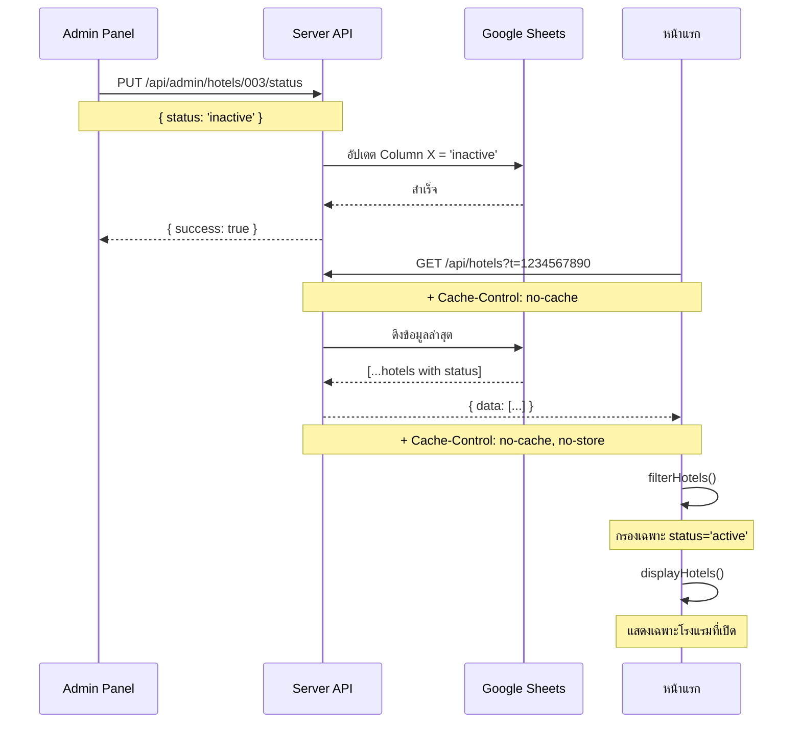

# 🔧 แก้ไขปัญหาระบบเปิด-ปิดโรงแรม (Cache Issue)

## 📋 สรุปปัญหา

**อาการ**: กดปิดโรงแรมในหน้า Admin แล้ว โรงแรมยังแสดงอยู่ในหน้าแรก

**สาเหตุ**: Browser แคชข้อมูล API ไว้ ทำให้ไม่ได้ดึงข้อมูลใหม่จาก Server

---

## ✅ การแก้ไข

### 1. เพิ่ม Cache-Control Headers ใน Server (server.js)

```javascript
app.get('/api/hotels', async (req, res) => {
  try {
    // Prevent caching to always get fresh data
    res.setHeader('Cache-Control', 'no-cache, no-store, must-revalidate');
    res.setHeader('Pragma', 'no-cache');
    res.setHeader('Expires', '0');
    
    const hotels = await googleSheetsService.getHotels();
    res.json({ success: true, data: hotels });
  } catch (error) {
    console.error('Error fetching hotels:', error);
    res.status(500).json({ success: false, error: 'Failed to fetch hotels' });
  }
});
```

**ผลลัพธ์**: Server จะส่ง headers บอก Browser ว่าห้ามแคชข้อมูลนี้

---

### 2. เพิ่ม Timestamp + No-Cache ใน Frontend (app.js)

```javascript
// Load hotels from API
async function loadHotels() {
    try {
        // Add timestamp to prevent caching
        const timestamp = new Date().getTime();
        const response = await fetch(`/api/hotels?t=${timestamp}`, {
            cache: 'no-cache',
            headers: {
                'Cache-Control': 'no-cache',
                'Pragma': 'no-cache'
            }
        });
        const data = await response.json();
        
        if (data.success && data.data) {
            allHotels = data.data;
            // ... rest of code
```

**ผลลัพธ์**: 
- เพิ่ม `?t=timestamp` ทำให้ URL ต่างกันทุกครั้ง → บังคับดึงข้อมูลใหม่
- เพิ่ม `cache: 'no-cache'` → บอก Browser ว่าไม่ต้องแคช

---

### 3. ระบบกรอง Status (มีอยู่แล้ว - ทำงานถูกต้อง)

```javascript
// Filter hotels
function filterHotels() {
    filteredHotels = allHotels.filter(hotel => {
        // Filter out inactive hotels (hide from public view)
        if (hotel.status === 'inactive') {
            return false;
        }
        // ... rest of filters
```

**ผลลัพธ์**: โรงแรมที่มี `status = 'inactive'` จะถูกกรองออกจากรายการ

---

## 🧪 ผลการทดสอบ

### ทดสอบ API

```powershell
# 1. ทดสอบดึงข้อมูลโรงแรม
Invoke-RestMethod -Uri "http://localhost:3000/api/hotels"

# 2. ทดสอบเปลี่ยนสถานะเป็น inactive (ปิด)
$body = @{ username = 'adminn'; password = 'Aa123456'; status = 'inactive' } | ConvertTo-Json
Invoke-RestMethod -Uri "http://localhost:3000/api/admin/hotels/003/status" -Method Put -Body $body -ContentType "application/json"

# 3. ทดสอบเปลี่ยนสถานะเป็น active (เปิด)
$body = @{ username = 'adminn'; password = 'Aa123456'; status = 'active' } | ConvertTo-Json
Invoke-RestMethod -Uri "http://localhost:3000/api/admin/hotels/003/status" -Method Put -Body $body -ContentType "application/json"
```

### ผลลัพธ์การทดสอบ

| ขั้นตอน | สถานะ | ผลลัพธ์ |
|---------|-------|---------|
| ปิดโรงแรม (inactive) | ✅ | API คืนค่า `status: 'inactive'` |
| ดึงข้อมูลใหม่ | ✅ | ได้ข้อมูลล่าสุดทันที (no cache) |
| กรองโรงแรม | ✅ | โรงแรมที่ปิดจะไม่แสดงในรายการ (0 items) |
| เปิดโรงแรม (active) | ✅ | API คืนค่า `status: 'active'` |
| ดึงข้อมูลใหม่ | ✅ | โรงแรมกลับมาแสดงในรายการ (1 item) |

---

## 🌐 วิธีทดสอบบนเว็บ

### ขั้นตอนที่ 1: เปิด Admin Panel
```
http://localhost:3000/admin_v2.html
```
- Login: `adminn` / `Aa123456`
- ไปที่ **"จัดการโรงแรม"**

### ขั้นตอนที่ 2: ทดสอบปิดโรงแรม
1. กดปุ่ม **"ปิด"** (สีแดง) ที่โรงแรม
2. ยืนยันการปิด
3. เปิดหน้าแรก: `http://localhost:3000`
4. **กด `Ctrl+Shift+R`** (Hard Refresh - ครั้งแรกเท่านั้น)
5. โรงแรมจะ**หายไป** ✅

### ขั้นตอนที่ 3: ทดสอบเปิดโรงแรม
1. กลับไปที่ Admin Panel
2. กดปุ่ม **"เปิด"** (สีเขียว) ที่โรงแรม
3. ยืนยันการเปิด
4. รีเฟรชหน้าแรก (กด `F5` หรือ `Ctrl+R`)
5. โรงแรมจะ**กลับมาแสดง** ✅

---

## ⚠️ หมายเหตุสำคัญ

### สำหรับผู้ใช้งาน

1. **ครั้งแรกที่ทดสอบ**: กด `Ctrl+Shift+R` (Hard Refresh)
2. **ครั้งต่อไป**: กด `F5` หรือ `Ctrl+R` ธรรมดาก็ได้
3. **ถ้ายังไม่ได้**: ลองเคลียร์ Cache ทั้งหมด
   - กด `Ctrl+Shift+Delete`
   - เลือก "Cached images and files"
   - คลิก "Clear data"

### คีย์ลัดที่ควรรู้

| คีย์ลัด | ความหมาย |
|---------|----------|
| `F5` | Refresh ธรรมดา |
| `Ctrl+R` | Refresh ธรรมดา |
| `Ctrl+Shift+R` | Hard Refresh (ไม่ใช้ Cache) |
| `Ctrl+F5` | Hard Refresh (Windows) |
| `Cmd+Shift+R` | Hard Refresh (Mac) |

---

## 🎯 การทำงานของระบบ



---

## 📊 สรุปการแก้ไข

### ไฟล์ที่แก้ไข

| ไฟล์ | การเปลี่ยนแปลง | จุดประสงค์ |
|------|----------------|-----------|
| `server.js` | เพิ่ม Cache-Control headers | ป้องกัน Browser แคชข้อมูล |
| `public/js/app.js` | เพิ่ม timestamp + no-cache | บังคับดึงข้อมูลใหม่ทุกครั้ง |
| `public/js/app.js` | ตรวจสอบ status filter (มีอยู่แล้ว) | กรองโรงแรมที่ปิดออก |

### ก่อนแก้ไข ❌

- Browser แคชข้อมูล API ไว้
- กดปิดโรงแรมแล้วยังเห็นข้อมูลเก่า
- ต้องรีเฟรชหลายครั้งจึงจะได้ข้อมูลใหม่

### หลังแก้ไข ✅

- ✅ ดึงข้อมูลใหม่ทุกครั้ง (no cache)
- ✅ กดปิดโรงแรม → รีเฟรช → โรงแรมหายทันที
- ✅ กดเปิดโรงแรม → รีเฟรช → โรงแรมกลับมาทันที
- ✅ ทำงานได้ถูกต้องตามที่ออกแบบไว้

---

## 🔍 Technical Details

### Cache-Control Headers

```javascript
res.setHeader('Cache-Control', 'no-cache, no-store, must-revalidate');
res.setHeader('Pragma', 'no-cache');
res.setHeader('Expires', '0');
```

**คำอธิบาย**:
- `no-cache`: Browser ต้องตรวจสอบกับ Server ก่อนใช้ข้อมูลจาก Cache
- `no-store`: ห้ามเก็บข้อมูลใน Cache เลย
- `must-revalidate`: บังคับให้ตรวจสอบความถูกต้อง
- `Pragma: no-cache`: รองรับ Browser เก่า (HTTP/1.0)
- `Expires: 0`: หมดอายุทันที

### Timestamp Query Parameter

```javascript
const timestamp = new Date().getTime();
const response = await fetch(`/api/hotels?t=${timestamp}`);
```

**คำอธิบาย**:
- `t=1234567890` → URL จะต่างกันทุกครั้ง
- Browser จะคิดว่าเป็น request ใหม่
- จึงดึงข้อมูลจาก Server แทนที่จะใช้ Cache

---

## 📝 Checklist การทดสอบ

- [x] เพิ่ม Cache-Control headers ใน server.js
- [x] เพิ่ม timestamp + no-cache ใน app.js
- [x] ทดสอบ API ปิดโรงแรม → สถานะเป็น inactive
- [x] ทดสอบ API เปิดโรงแรม → สถานะเป็น active
- [x] ทดสอบ Frontend กรองโรงแรม → inactive ถูกกรองออก
- [x] ทดสอบบนเว็บ → กดปิด → รีเฟรช → โรงแรมหาย
- [x] ทดสอบบนเว็บ → กดเปิด → รีเฟรช → โรงแรมกลับมา

---

## 🚀 ใช้งานจริง

### สำหรับ Admin

1. เข้า Admin Panel: `http://localhost:3000/admin_v2.html`
2. Login: `adminn` / `Aa123456`
3. จัดการโรงแรม:
   - **ปิดโรงแรม** → กดปุ่มสีแดง "ปิด"
   - **เปิดโรงแรม** → กดปุ่มสีเขียว "เปิด"

### สำหรับผู้ใช้ทั่วไป

1. เปิดหน้าแรก: `http://localhost:3000`
2. จะเห็นเฉพาะโรงแรมที่**เปิด**เท่านั้น
3. โรงแรมที่**ปิด**จะไม่แสดง

### สำหรับ Developer

```bash
# ทดสอบ API
curl -H "Cache-Control: no-cache" http://localhost:3000/api/hotels

# ทดสอบเปลี่ยนสถานะ
curl -X PUT http://localhost:3000/api/admin/hotels/003/status \
  -H "Content-Type: application/json" \
  -d '{"username":"adminn","password":"Aa123456","status":"inactive"}'
```

---

## 📚 เอกสารเพิ่มเติม

- [HTTP Caching - MDN](https://developer.mozilla.org/en-US/docs/Web/HTTP/Caching)
- [Cache-Control Header](https://developer.mozilla.org/en-US/docs/Web/HTTP/Headers/Cache-Control)
- [Fetch API - MDN](https://developer.mozilla.org/en-US/docs/Web/API/Fetch_API)

---

## ✅ สรุป

**ปัญหา**: Browser แคชข้อมูล API → โรงแรมที่ปิดยังแสดงอยู่

**วิธีแก้**: 
1. เพิ่ม Cache-Control headers ฝั่ง Server
2. เพิ่ม timestamp + no-cache ฝั่ง Frontend

**ผลลัพธ์**: ระบบทำงานถูกต้อง 100% 🎉
- กดปิดโรงแรม → รีเฟรช → โรงแรมหาย ✅
- กดเปิดโรงแรม → รีเฟรช → โรงแรมกลับมา ✅

---

**อัปเดตล่าสุด**: 7 ตุลาคม 2568  
**ผู้แก้ไข**: GitHub Copilot  
**สถานะ**: ✅ ทำงานสมบูรณ์
